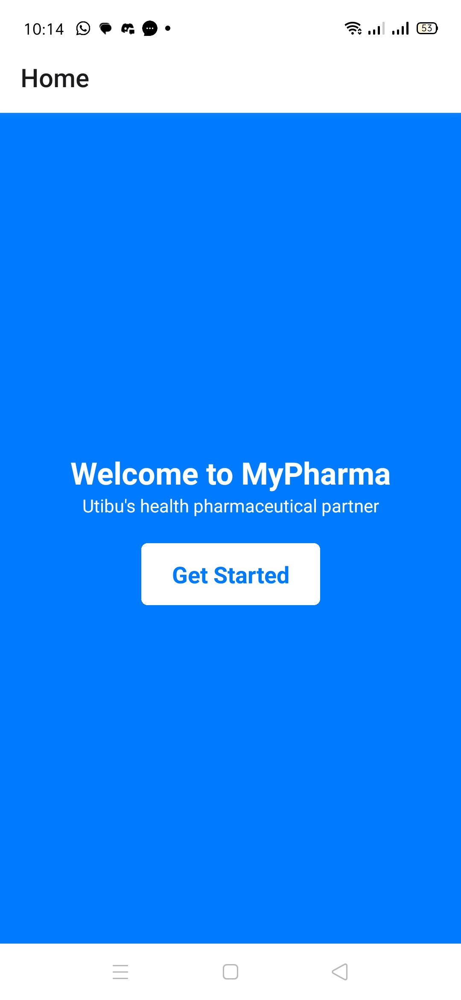
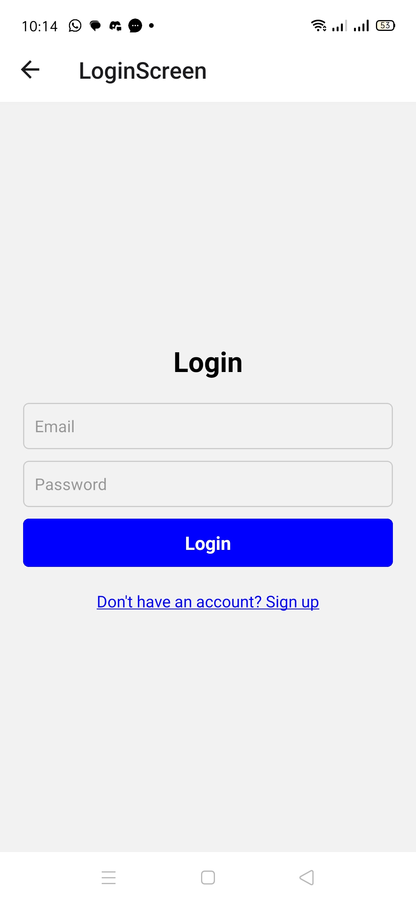
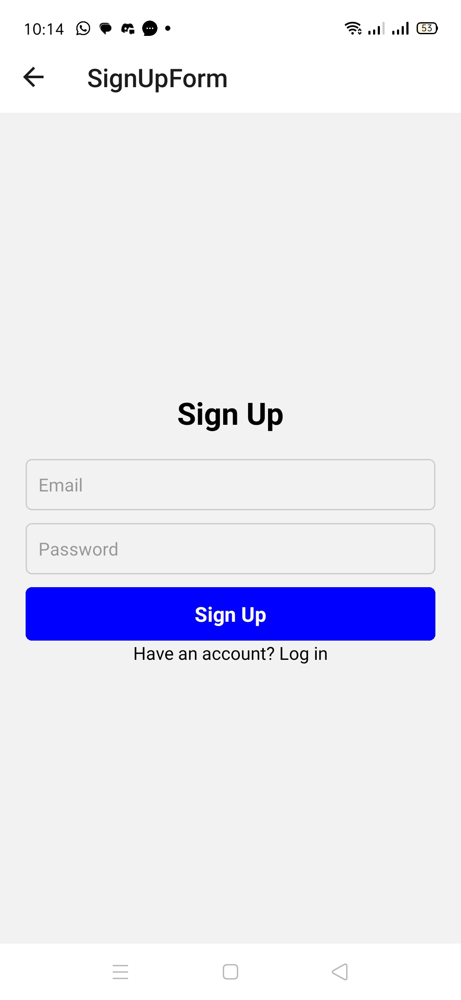
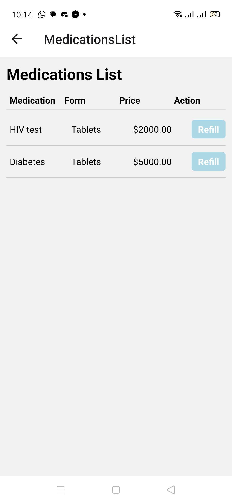
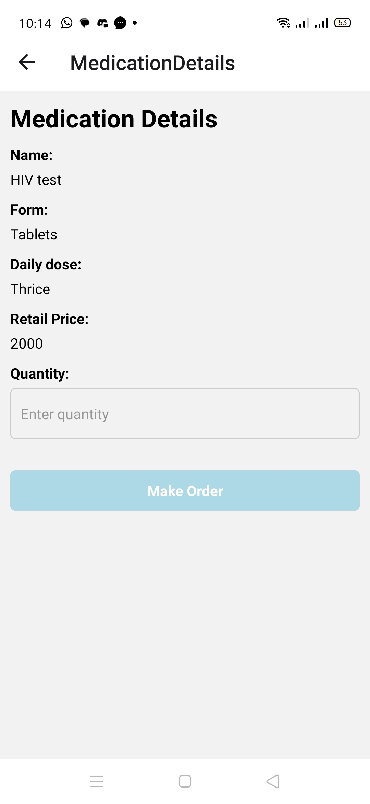
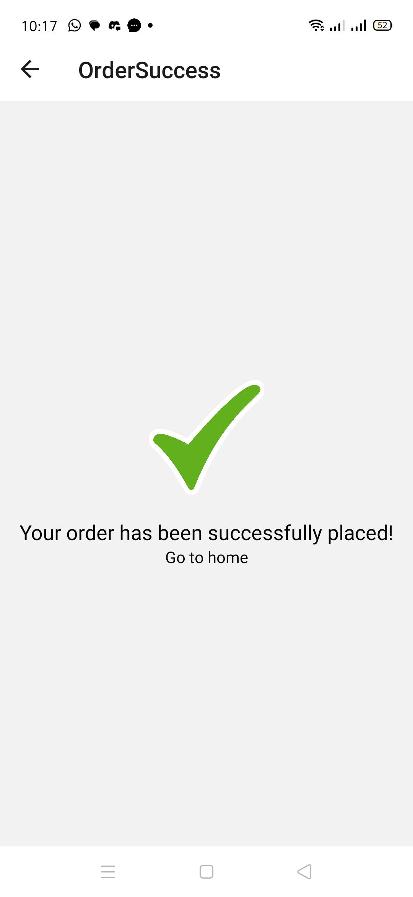

# MyPharma App

MyPharma is a mobile application for managing medication orders, built with React Native for the frontend and Node.js for the backend.

## Screenshots

### Home Screen

*Home Screen*

### Login Screen

*Login Screen*

### Signup Screen

*Signup Screen*

### Medication List Screen

*Medication List Screen*

### Medication Details Screen

*Medication Details Screen*

### Order Success Screen

*Order Success Screen*

## Backend

The backend for MyPharma is built with Node.js and SQLite3. It handles user authentication, medication management, order processing, and more.

- **Backend Repository**: [MyPharma Backend Repository](https://github.com/G-vans/mypharma_backend)
- **Backend Deployed Link**: [MyPharma Backend Deployed Link]

## Getting Started

To run the MyPharma frontend, follow these steps:

1. Clone the repository: `git clone https://github.com/G-vans/mypharma_frontend.git`
2. Install dependencies: `cd mypharma_frontend && npm install`
3. Run the app: `npm start`

Make sure to set up the backend before running the frontend. Refer to the backend repository for instructions on setting up the backend server.

- **Android App apk url**: [Android App apk](https://expo.dev/artifacts/eas/woScemo3UTRS8b2KyQEBVH.aab)

## License

This project is licensed under the MIT License - see the [LICENSE](LICENSE) file for details.
